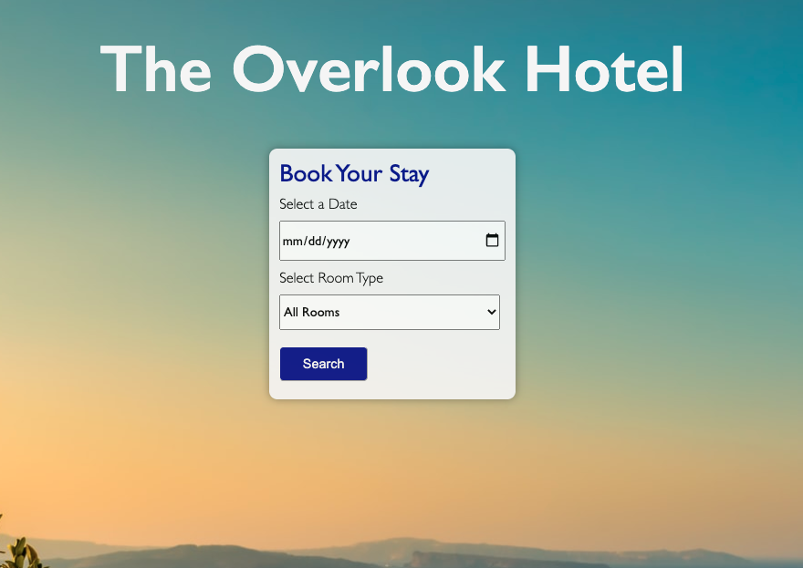

# Overlook! 

# About
Final Solo Project for Mod 2: Overlook is hotel management tool for hotel customers and staff to manage room bookings. 

# Features
When logging in as a guest, the guest's name, bookings, and their total amount spent at the hotel are displayed. A guest can view all available rooms that meet their search criteria for date and room type, and make a new reservation.

When logging in as a manager, the total amount of rooms available, total revenue for today's date, and percentage of occupied rooms for today will be displayed. 
A manager can search for a guest by name and view all of the guests bookings.

# Set-Up
To install this app, clone the repository and enter the following into the terminal:
- `npm install` to start the server run
- `npm start` and navigate to http://localhost:8080/ in your browser. 

**Guest Login**  
Username: customer[1-50]   
Password: overlook2020  

**Manager Login**  
Username: manager  
Password: overlook2020   

# App in Action

 
*If a manager logs in the manager dashboard will be displayed*

 
*A guest can filter available rooms by date and room type*

# Technologies / Systems
- Javascript
- TDD with Mocha/Chai 
- Fetch API 
- Webpack 

# Reflections
I was challenged by the complexity of the project and the amount of DOM manipulation 

Given more time I would spend more time on the UI and complete the Manager Interation functionality, enabling the manager to book/delete a reservation for a guest. 

# Contributors
[Steph Norton](https://github.com/NakiNorton)

